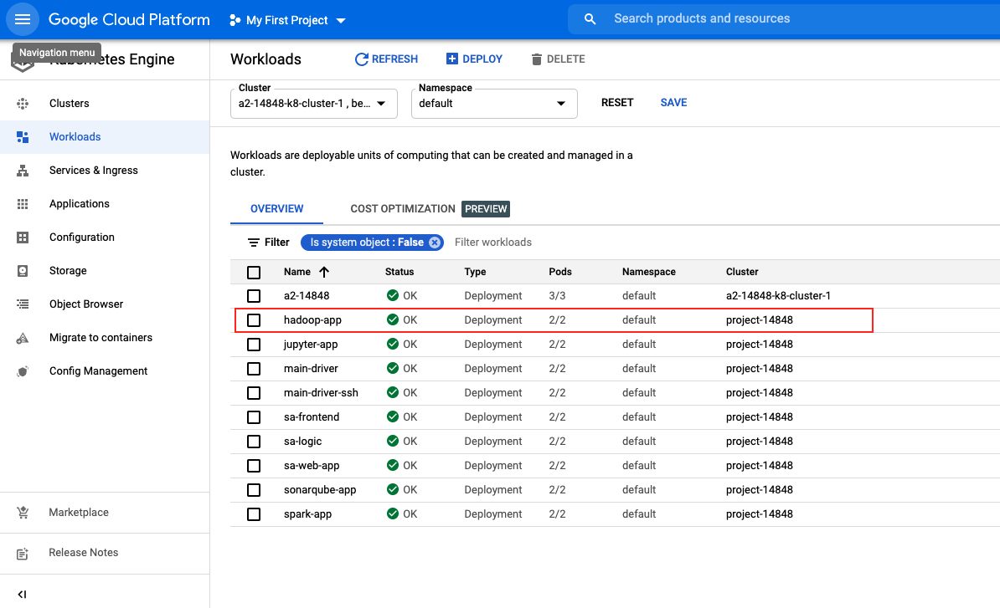
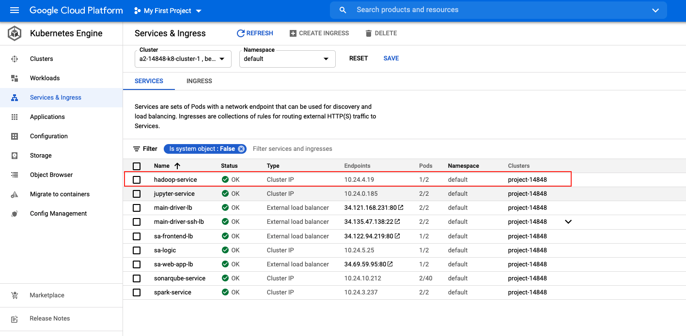

# 14848_cloud_infra_proj_hadoop

## Hadoop bug fix
- Notice that if you want to use customized url path for the reverse proxy, please use my customized `hadoop-yarn-common-3.3.1.jar` (https://github.com/shihsunl/14848_cloud_infra_proj_hadoop/tree/master/hadoop_fix). I've fixed a bug of showing image for hadoop WebUI. Please check `Dockerfile` to get more information.

## How to build docker image
- Run `docker build --no-cache --progress=plain -t YOUR_DOCKER_ID/14848_proj_hadoop . ` and push the image to DockerHub.

## Deploy docker image to Google Cloud Platform Kubernetes Cluster
- Open Cloud Shell on GCP and clone the repository:
```
git clone https://github.com/shihsunl/14848_cloud_infra_proj_hadoop.git
```
- Modify docker image in `resource-manifests/hadoop_deployment.yaml`.
- Execute 2 yaml file in resource-manifests folder.
```
cd 14848_cloud_infra_proj_hadoop/resource-manifests/
kubectl apply -f hadoop_deployment.yaml
kubectl create -f service-hadoop.yaml
```
- Then, you can check Workloads and Service & Ingress



- Next, you can access to the Service Website and select the hadoop service. Please check: `https://github.com/shihsunl/14848_cloud_infra_proj_driver`
